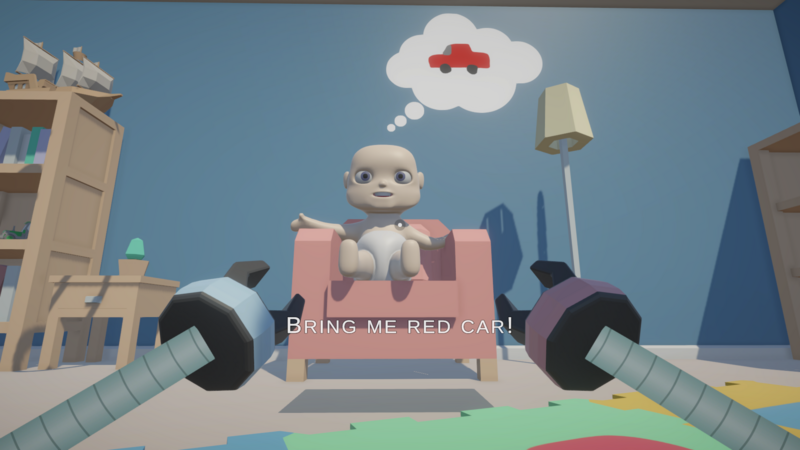

# Playtime

## About

Playtime is a **first-person arcade** game made in less than **48h** during [KrakJam 2024](https://globalgamejam.org/jam-sites/2024/krakjam-2024) (theme *"Make Me Laugh"*). The main goal is to **complete objectives** that are requested by the kid. The player is his new toy and is supposed to make him happy (laugh). There are two types of objectives: **requests** and **punishments**. If the player does not complete a request (the kid is sad) a punishment is triggered. The player controls a robot with **grappling hook** hands. The left hand **pulls the robot** towards the objects, and the right one **pulls the objects** towards the robot. The player can **run** and **jump**. Objectives are **issued sequentially**, and the sequence is **randomized**. Each objective has a **time limit**. The player can increase **score** by completing these objectives. The game ends when the player **dies** or **completes** all objectives.

*There is one known issue with objective sequence stalling, which requires a game restart.*

You can **download for Windows** by clicking [here](https://globalgamejam.org/games/2024/playtime-5).

A comment from @[m-biernat](https://github.com/m-biernat): *This is my first on site game jam, and a "successful" jam game after "creative blockade" that lasted for ~1 year. I tried and failed 4 online jams in a row. Each time I started a project and couldn't finish. So this game is some sort of breakthrough. The code is awful (a bunch of code smells) due to lack of sleep and overall fatigue. But it's working, so that's what matters the most :)*

## Tools & Dependencies

 - [Unity 2022.3.17](https://unity.com/releases/editor/whats-new/2022.3.17) - game engine;
 - [DOTween](https://assetstore.unity.com/packages/tools/animation/dotween-hotween-v2-27676) - to animate stuff;
 - [Blender 3.6 LTS](https://www.blender.org/download/releases/3-6/) - to create/modify 3D models.

## Credits

 - **Michał Biernat** @[m-biernat](https://github.com/m-biernat) - game designer and programmer;
 - **Anna Hosumbek** @[An-Hos](https://github.com/An-Hos) - game designer, level designer and 3D artist.

BGM and SFX are from [Freesound.org](https://freesound.org/), licensed under [CC0](https://creativecommons.org/publicdomain/zero/1.0/).

Some 3D models are from [Kenney](https://www.kenney.nl/), licensed under [CC0](https://creativecommons.org/publicdomain/zero/1.0/).

## License

The game project in `Assets\_Project\` directory is licensed under [CC BY-NC-SA 4.0 Deed](https://creativecommons.org/licenses/by-nc-sa/4.0/deed.en).
